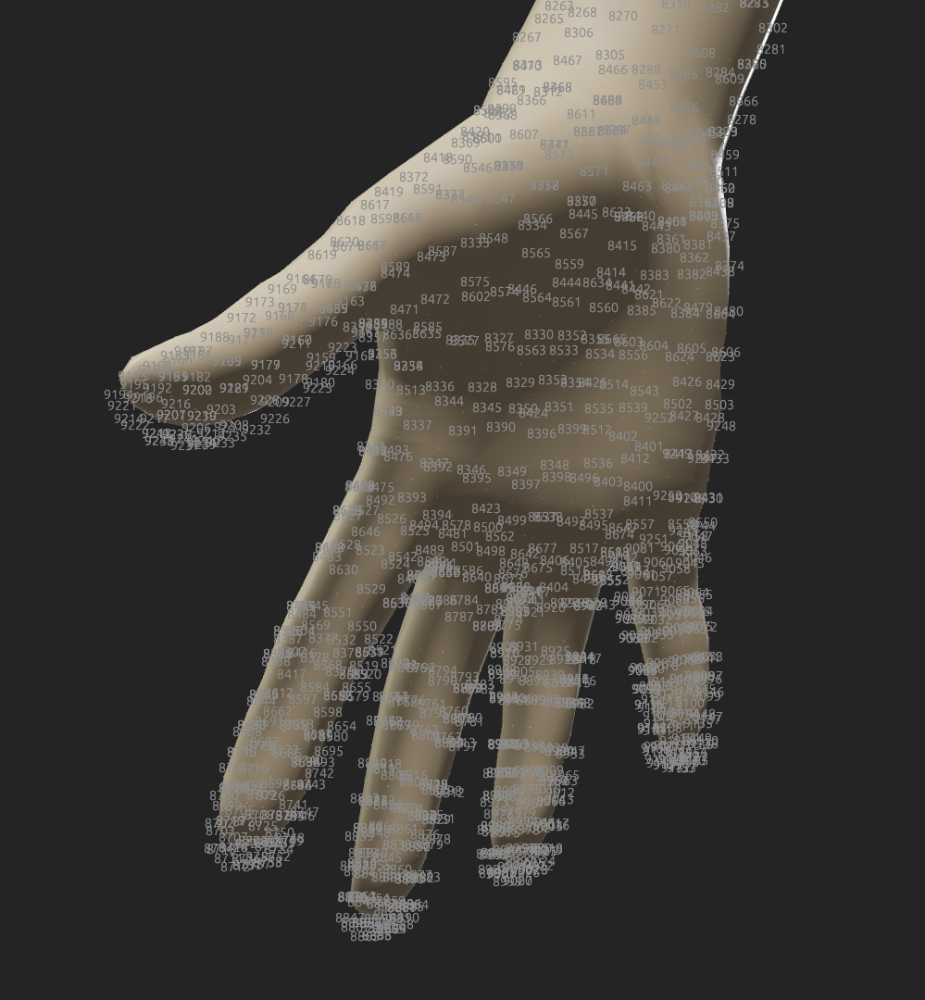

# Changelog

All notable changes to this project will be documented in this file.

Please keep one empty line before and after all headers. (This is required for
`git` to produce a conflict when a release is made while a PR is open and the
PR's changelog entry would go into the wrong section).

And please only add new entries to the top of this list, right below the `#
Unreleased` header.

# Unreleased

# 0.5.0

<!-- ### ⚠️ BREAKING -->
### ⭐ Added
- Added a `entity.has(comp)` method for all the components exposed to Python.
- Added Browserstack testing to CI
- Added functionality to create a camera frustum in 3D given camera intrinsics
### 🔧 Changed
- Performance improvements to calculation of normals and tangents by iterating through the vertices using fixed_sized vector instead of dynamic ones which allows for better loop vectorization
- Exposed the `viewer.config` as public
- Exposed `scene.create_floor()` as public
- Pinned the rust version of stable and nightly so the CI doesn't randomly break 
### 🐛 Fixed
- Fixed crash that could occur when showing custom gui elements but no entity was selected in the scene. 
- Fixed Tangent,Normals,Colors and other automatically added component from being a different shape than Verts.shape. Now they are recomputed or readded with dummy values so we make sure they always have the correct size
- Fixed the automatically calculated tangents being delayed by one frame. Now both Normals and Tangents are calculated in the first prepass of the renderer.

# 0.4.0

<!-- ### ⚠️ BREAKING -->
### ⭐ Added
- Added grid floor as option
- Added antialiasing to lines
- Added option to view point sized in world coordinates instead of screen-space
- Added sanity checks when adding Verts and Colors that have different shapes
<!-- ### 🔧 Changed -->
### 🐛 Fixed
- Fixed line rendering not rendering correctly when lines were behind the camera
- Made sure the resize event is called even if the event loop is stopped

# 0.3.0

<!-- ### ⚠️ BREAKING -->
### ⭐ Added
- Added way to disable the lighting computation in shaders and output directly the albedo color
- Added way to change the offscreen texture to be `RGBA32F` instead of `RGBA8`
### 🔧 Changed
- Adding a enitity to the scene that has only `Verts`, will automatically add `VisPoints` with `show_points=true`
<!-- ### 🐛 Fixed -->

# 0.2.0

<!-- ### ⚠️ BREAKING -->
### ⭐ Added
- Added way to upload textures using a reusable staging buffer which is slower but uses less memory. See `ImgConfig.fast_upload` and `preallocated_staging_buffer_bytes` in the config file.
- Added way to compute mipmaps on CPU instead of GPU because WebGL2 has issues with reading and writing from the same texture even if using different mips. See `ImgConfig.mipmap_generation_cpu`
<!-- ### 🔧 Changed -->
<!-- ### 🐛 Fixed -->

#  0.1.3

This release includes several Qol changes on the python API to ease some restrictions around parameter types and a lot of new types exposed from Rust to Python. Additionally we also added new debugging tools in the form of point indices:
Finally a major memory leak inside wgpu was fixed that was causing repeted recreationg of the Viewer to not drop all of it's memory.

### ⚠️ BREAKING
- Camera functions for `set_position` and `set_lookat` take arrays or lists instead of separate x,y,z components. So instead of `cam.set_position(0.0, 1.5, 2.0)` we now use `cam.set_position([0.0, 1.5, 2.0])`
- The `Viewer` no longer initializes a loggin system by default. If you want to view logs from running the viewer, either explicitly call `gloss_setup_logger` once per execution process or set `auto_create_logger` in the config.toml file provided to the Viewer. 
- Renamed `depth_remap_reverse_z` function to `depth_linearize`

### ⭐ Added
- Exposed `PointColorType` to python 
- Exposed `UVs` and `Normals` components to python 
- Added `DynImage` as a Rust and Python type for generic images. It also offers functions for converting to and from numpy.
- Added `Geom` functions for `sample_img_with_uvs`, `splat_rows`, `filter_rows` and `apply_indirection`. These are very useful when selecting certain vertices of a mesh and you want the faces indices to adjust accordingly.
- Added visualization of point indices. Can use used by inserting into an entity `entity.insert(VisPoints(show_points_indices=True))`
- Added functions for saving and entity as .ply or .obj: ` entity.save_ply(path)`
- Exposed to Python the camera lookat, up and position.
- Added to python function to `get_renderable_names` and `remove_renderable` given a certain name.
- Added ply exporting with color information.

### 🔧 Changed
- Many python functions that before required a numpy array of f32, now also work with lists and with f64 data, dynamically converting when necessary. So functions like `Geom.build_cube( np.array([0, 0.0, 0], dtype = "float32") )` can now be written as `Geom.build_cube( center=[0, 0.0, 0] )`. Similarly also to the color types in `VisMesh`, `VisPoints`, etc.
- Maximum buffer size on GPU raised above the default of 256MB. The GPU will automatically pick the maximum it can.

### 🐛 Fixed
- Fixed memory leak that occured when recreating the `Viewer` or `ViewerHeadless` multiple times. Issue on wgpu side <https://github.com/gfx-rs/wgpu/issues/5529>
- Fixed wasm build which couldn't render due to the depth map with multisample having the COPY_SRC flag.

# 0.1.2

### ⭐ Added
- Added being able to get depth maps from gloss. An example can be found in `bindings/examples/gloss_py/depth_map.py` 
- Added shape checks when setting from python the vertex atributes like `Verts` or `Colors`
- Added `zbuffer` for points also which allows the user to render point clouds regardless if they are occluded by the zbuffer or not.
- Added CI/CD pipeline for building `gloss_py` with various architectures and publishing to private pypi repo.

### 🐛 Fixed
- Fixed the renderer breaking when there are no entities present in the scene on the first rendered frame. This was causing issues with the drag_and_drop examples. 
- Fixed reading of ply files with uint as face indices. Before only int32 was supported.

# 0.1.1

### ⚠️ BREAKING
- Camera functions in python no longer need a `scene` argument. So orbitting the camera can be done with `cam.orbit_y(30.0)` instead of `cam.orbit_y(30.0, scene)` and similarly for all other camera-related functions.

### ⭐ Added
- Added line rendering capabilities. One can render lines by inserting into an entity the components `Verts`, `Edges` and `VisLines`. Also see `bindings/examples/gloss_py/show_lines.py`
- Added memory profiling capabilities that can be enabled by adding the following to `core` section of the `config.toml` provided the viewer: `enable_memory_profiling_callstacks= true`. The callstacks that allocated the most memory are shown in the GUI. Also on WASM there is a memory bar showing the allocations in the linear memory.
- Added camera intrinsics and extrinsics which can be set using `cam.set_extrinsics()` and `cam.set_intrinsics()`. See `bindings/examples/gloss_py/intrinsics_extrinsics.py` for more details

<!-- ### 🔧 Changed -->
<!-- ### 🐛 Fixed -->

# 0.1.0

- Initial version on private pypi