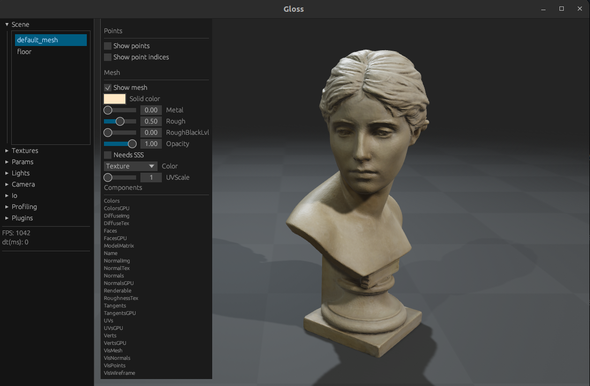

# Gloss 

Gloss is a light-weight Physically-based Renderer, written in Rust + wgpu

The main functionality includes loading meshes with high-resolution textures, rendering them with advanced graphics features, and allowing a general framework to explore new rendering techniques.
Gloss also compiles for Python and Web, allowing for rendering in multiple different environments.


<!-- ## Usage
An example of a python3 script which shows a single mesh using the default viewing parameters:
```python
    from gloss_py  import *

    viewer=Viewer()
    scene=viewer.get_scene()

    mesh = scene.get_or_create_entity("test")
    mesh.insert_builder(Geom.build_from_file("my_path/mesh.obj")) 

    while True:
        viewer.start_frame()
        viewer.update() 
``` -->

## Installation
The main dependency is installing Rust, as the rest of dependencies are handled by cargo. 
To install Rust, simply run the following in your terminal: 
```sh
$ curl --proto '=https' --tlsv1.2 https://sh.rustup.rs -sSf | sh
```

Additional dependencies for Linux:
```sh
$ sudo apt-get install libvulkan-dev vulkan-tools xorg-dev libxkbcommon-x11-dev
```
For `MacOs`, it should run out of the box.

<!-- Additional dependencies for WSL:
```sh
$ sudo apt-get install libvulkan-dev xorg-dev libxkbcommon-x11-dev
$ sudo add-apt-repository ppa:kisak/kisak-mesa
$ sudo apt update
$ sudo apt upgrade
$ sudo apt install vulkan-tools
```
Afterwards, follow the instructions in: https://github.com/bevyengine/bevy/pull/5040#issuecomment-1494706996
You also cannot run this in docker because vulkan doesn't work in docker and WSL.
Also, you need to run in X11 and not in wayland, so you need to run:
unset WAYLAND_DISPLAY

Additional dependencies for MacOS:
```sh
$ 
``` -->

For Python bindings, maturin is required:
```sh
$ python3 -m pip install maturin
```
For Web, we use wasm-pack:
```sh
$ curl https://rustwasm.github.io/wasm-pack/installer/init.sh -sSf | sh
```

### Install and Run Rust Native 
```sh
$ cd gloss
$ cargo build
$ cargo run --bin gloss_view_mesh
```

### Install and Run Python 
```sh
$ cd gloss/bindings/gloss_py
$ ./scripts/build_local.sh
$ ./examples/empty.py
```


### Install Web
```sh
$ cd gloss/examples/web
$ wasm-pack build --target web
```
To run the web example, we can create a dummy web server by opening another terminal and running:
```sh
$ cd gloss/examples/web
$ python -m http.server 
```
Finally, navigate to `http://0.0.0.0:8000/gloss_webpage/` in your browser of choice.

## Examples

Various examples can be found in the ./examples folder. A short description of each one is given here: 

| Name  | Description |
| ------------- | ------------- |
| Mesh View |  Visualizes a mesh with textures. <br /> Run with [cargo r --bin `gloss_view_mesh`](./examples/view_mesh) |


## Misc 
### Publish python 
Check the readme in `gloss/bindings/gloss_py`.


## Create documentation
In the root of the gloss workspace:
```sh
$ cargo doc --no-deps --workspace
```
Afterwards, open `gloss/target/doc/gloss_renderer/index.html` in your browser.


## Planned features
- `PyTorch` integration
- Differentiable rendering
- Area lights 
- Subsurface scattering
- Order-independent transparency 
- Support for Gaussian Splatting 

## Troubleshoot
If you have a laptop with both Intel graphics and NVIDIA, go to nvidia-settings and set the GPU to performance mode. Letting it run "on-demand" can cause issues with an external monitor: `<https://askubuntu.com/a/1447935>`

If there are any exceptions that mention "Maybe there's a driver issue on your machine?", please check that you have GPU vulkan drivers installed (`libvulkan-dev vulkan-tools`) and running `vulkaninfo | grep GPU` shows a real GPU and not a software solution like llvmpipe.

If there are still issues with "Maybe there's a driver issue on your machine", you can switch to GL backend with:
```sh
$ sudo apt-get install mesa-utils libegl-dev
$ sudo usermod -a -G render $USER
$ sudo usermod -a -G video $USER
RELOG 
$ LD_PRELOAD=/usr/lib/x86_64-linux-gnu/libstdc++.so.6 WGPU_BACKEND=gl MY_SCRIPT
```
Partially, this solution comes from "Solution 1" from `<https://stackoverflow.com/a/72427700>`, where it seems that conda can cause issues. 

Another solution might be: `conda install -c conda-forge libstdcxx-ng`

## Acknowledgements and Credits
* [Rerun](https://github.com/rerun-io/rerun)
* [Bevy](https://github.com/bevyengine/bevy)
* [HECS](https://github.com/Ralith/hecs)
* [Bust of Róża Loewenfeld](https://sketchfab.com/3d-models/sculpture-bust-of-roza-loewenfeld-fc6e731a0131471ba8e45511c7ea9996)